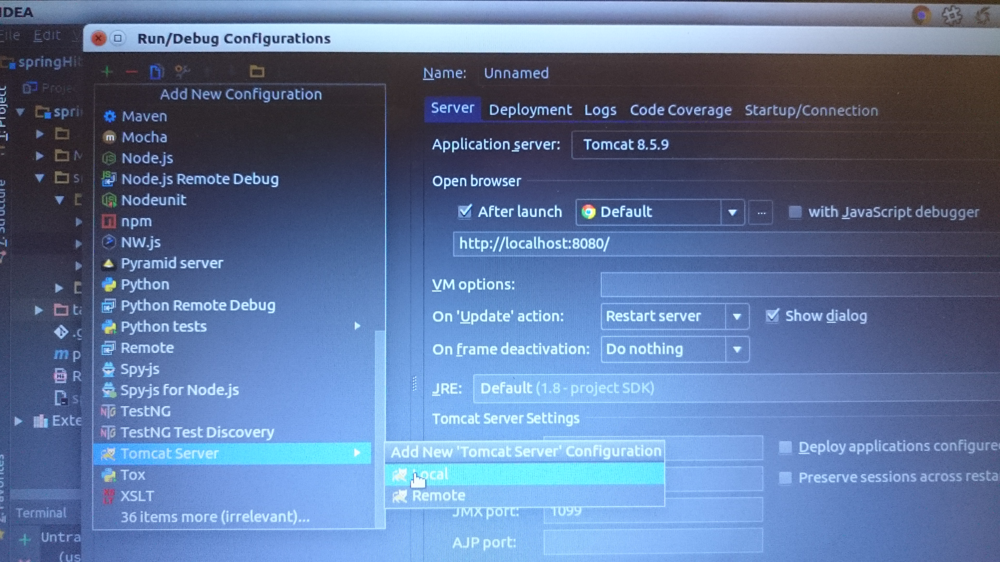
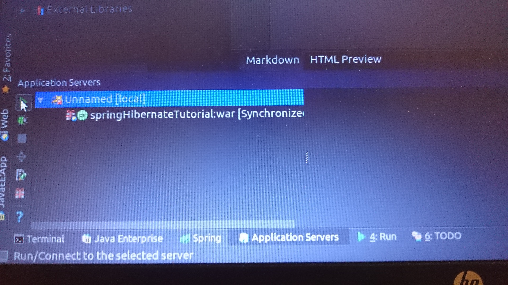

Initializing information

1. fill with your database's property the `src/main/resources/application.properties` file
2. run `createTable.sql` file to create Employee table
3. in IntelliJ IDE you have to edit configuration

